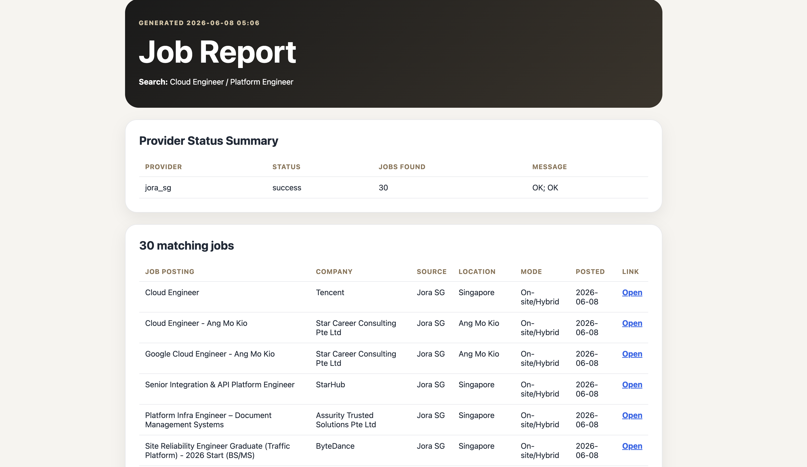
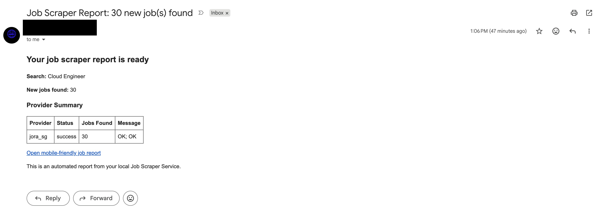
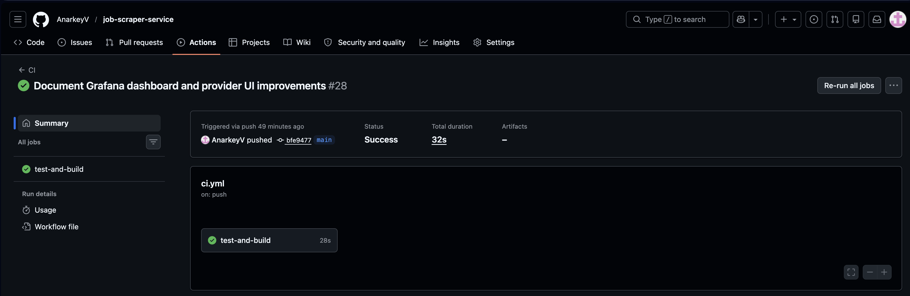
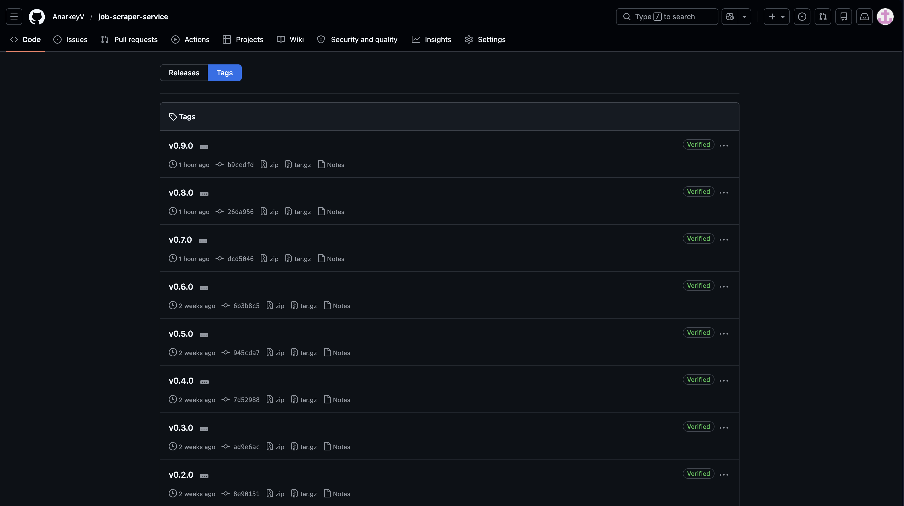
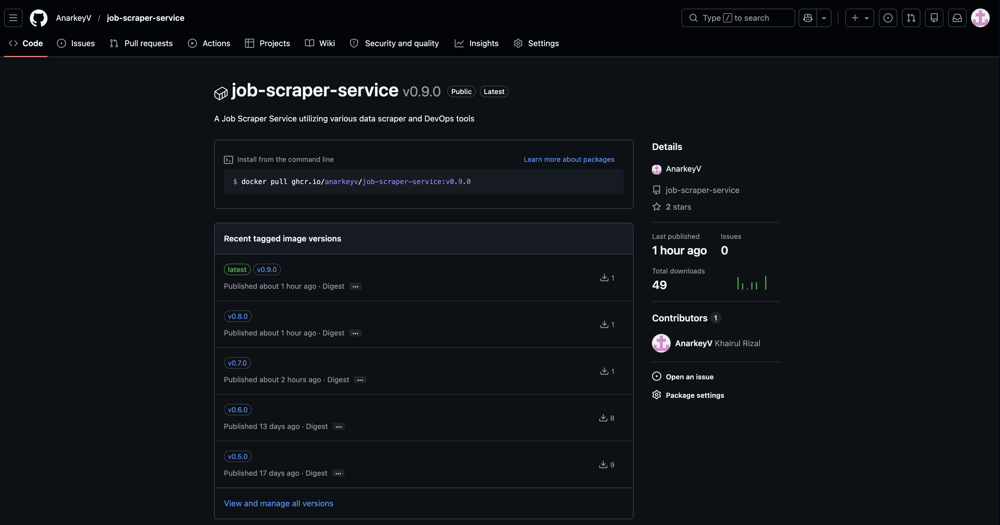

[](https://github.com/anarkeyv/job-scraper-service/actions)
[](https://www.python.org/)
[](https://fastapi.tiangolo.com/)
[](https://www.docker.com/)
[](https://github.com/users/anarkeyv/packages/container/package/job-scraper-service)
[](https://www.jenkins.io/)
[](https://prometheus.io/)
[](https://grafana.com/)
[](https://www.ansible.com/)
[](#project-status)

# 🔎 Job Scraper Service — DevOps Portfolio Project

A lightweight, local-first job alert platform built with **FastAPI**, **SQLite**, **Docker**, **GitHub Actions**, **Jenkins**, **Prometheus**, **Grafana**, and **Ansible**.

This project started as a simple job alert form, but gradually evolved into a full DevOps learning sandbox that demonstrates application development, CI/CD, containerisation, monitoring, provider reliability tracking, dashboard provisioning, and local deployment automation.

The goal of this project is not only to scrape jobs. The bigger goal is to show how a small application can be built, tested, containerised, monitored, versioned, released, and prepared for future cloud or homelab deployment.

---

## 📋 Table of Contents

- [Project Status](#project-status)
- [Project Overview](#project-overview)
- [Key Features](#key-features)
- [Screenshots and Evidence](#screenshots-and-evidence)
- [Architecture](#architecture)
- [Tech Stack](#tech-stack)
- [Application Routes](#application-routes)
- [Provider Support](#provider-support)
- [Provider Status Reporting](#provider-status-reporting)
- [Monitoring and Observability](#monitoring-and-observability)
- [DevOps Workflow](#devops-workflow)
- [Local Development](#local-development)
- [Docker Compose](#docker-compose)
- [GitHub Container Registry](#github-container-registry)
- [Jenkins Pipeline](#jenkins-pipeline)
- [Ansible Deployment](#ansible-deployment)
- [Project Structure](#project-structure)
- [Release History](#release-history)
- [Skills Demonstrated](#skills-demonstrated)
- [Troubleshooting Notes](#troubleshooting-notes)
- [Current Limitations](#current-limitations)
- [Future Improvements](#future-improvements)

---

## ✅ Project Status

| Area | Status |
|---|---|
| FastAPI web application | Completed |
| Job alert creation form | Completed |
| SQLite persistence | Completed |
| HTML job report generation | Completed |
| Email report delivery | Completed |
| Provider selection | Completed |
| Select all / unselect all sources | Completed |
| Singapore job portal search-link provider | Completed |
| Jora SG parser test | Completed |
| Provider status reporting | Completed |
| Provider status history page | Completed |
| Provider/status filters | Completed |
| Provider status UI badges | Completed |
| Dockerfile | Completed |
| Docker Compose | Completed |
| GitHub Actions CI | Completed |
| GitHub Container Registry publishing | Completed |
| Jenkins validation pipeline | Completed |
| Prometheus monitoring | Completed |
| Grafana datasource provisioning | Completed |
| Grafana dashboard provisioning | Completed |
| Ansible local deployment automation | Completed |
| Kubernetes starter folder | Prepared |
| Terraform starter folder | Prepared |
| Current release | `v0.9.0` |

> **Current branch:** `main`  
> **Current release:** `v0.9.0 - Grafana Dashboard and Provider UI Improvements`  
> **Project state:** Portfolio-ready MVP with DevOps evidence

---

## 📖 Project Overview

Job Scraper Service allows a user to create job alerts based on a main job title, alternate job title, email address, country, work mode, job posting age, report frequency, scan frequency, and selected job providers.

After a job alert is submitted, the application saves the subscription, runs a background scan, records provider-level status, generates an HTML report, and sends the report link by email.

The project is intentionally designed to be lightweight and local-first. It can run on a laptop, small server, homelab machine, or cloud VM.

---

## ✨ Key Features

| Feature | Description |
|---|---|
| **Job Alert Form** | Web form for creating job search subscriptions |
| **Primary and Alternate Search Terms** | Supports two search phrases per alert |
| **Provider Selection** | User can choose which job sources to use |
| **Select All / Unselect All** | Easier provider selection on the homepage |
| **SQLite Database** | Local persistence for subscriptions, scan runs, reports, and provider status |
| **Background Scan** | Runs scans after a subscription is created or manually triggered |
| **HTML Reports** | Generates readable job reports with matching roles |
| **Email Delivery** | Sends report links and provider summaries by email |
| **Provider Summary in Email** | Email body shows provider-level scan results |
| **Provider Status Summary in Report** | Report shows whether each provider succeeded, failed, or returned no jobs |
| **Provider Status History Page** | In-app operational view of recent provider scan results |
| **Provider Filters** | Filter provider history by provider and status |
| **Status Badges** | Green success and red failure badges improve readability |
| **Docker Support** | Application can run in a container |
| **Docker Compose Support** | Runs app, Prometheus, and Grafana together |
| **GitHub Actions CI** | Automated test workflow on push |
| **GHCR Publishing** | Docker image published to GitHub Container Registry |
| **Jenkins Pipeline** | Local Jenkins validates build, test, and smoke test flow |
| **Prometheus Metrics** | `/metrics` endpoint exposes app metrics |
| **Grafana Dashboard** | Provisioned dashboard shows service health and app counters |
| **Ansible Playbook** | Local deployment automation with health validation |

---

## 📸 Screenshots and Evidence

### Landing Page

The homepage allows users to create job alerts, choose sources, and manage existing subscriptions.


### Job Report with Provider Summary

Generated reports include both matching jobs and provider status information.



### Email Provider Summary

Email reports include a provider summary table so the user can quickly see whether selected sources worked.



### Provider Status History

The provider status page gives an operational view of recent provider scan results.


### Provider Status Filters

Provider results can be filtered by provider and status.


### Prometheus Target UP

Prometheus successfully scrapes the FastAPI application metrics endpoint.


### Grafana Dashboard

Grafana dashboard provisioning automatically loads the Job Scraper Service dashboard.


### GitHub Actions CI

GitHub Actions validates the project through the CI workflow.



### GitHub Release Tags

The project is versioned through Git tags and GitHub releases.



### GitHub Container Registry Package

The Docker image is published to GitHub Container Registry.



---

## 🏗️ Architecture

```text
┌──────────────────┐
│ User / Browser   │
└────────┬─────────┘
         │ creates job alert
         ▼
┌────────────────────────────┐
│ FastAPI Web Application    │
│ Forms, routes, templates   │
└────────┬───────────────────┘
         │ saves data
         ▼
┌────────────────────────────┐
│ SQLite Database            │
│ subscriptions, scans,      │
│ reports, provider status   │
└────────┬───────────────────┘
         │ runs scan
         ▼
┌────────────────────────────┐
│ Provider Registry          │
│ APIs, search links, parser │
└────────┬───────────────────┘
         │ returns results
         ▼
┌────────────────────────────┐
│ HTML Report + Email        │
│ provider summary included  │
└────────────────────────────┘
```

### DevOps Architecture

```text
Developer
   │
   │ git push
   ▼
GitHub Repository
   │
   ├── GitHub Actions CI
   │       └── run tests
   │
   ├── GitHub Release
   │       └── publish Docker image to GHCR
   │
   ├── Jenkins
   │       └── clone, build, test, smoke test
   │
   └── Docker Compose
           ├── FastAPI app
           ├── Prometheus
           └── Grafana
```

### Monitoring Flow

```text
FastAPI app exposes /metrics
        ↓
Prometheus scrapes job-scraper:8000
        ↓
Prometheus target shows UP
        ↓
Grafana connects to Prometheus
        ↓
Provisioned dashboard displays app health and counters
```

---

## 🛠️ Tech Stack

| Area | Technology |
|---|---|
| Backend | Python, FastAPI |
| Frontend | HTML, CSS, Jinja2 |
| Database | SQLite |
| Background Jobs | APScheduler / FastAPI background tasks |
| Email | SMTP |
| Job Provider Logic | httpx, BeautifulSoup, provider registry |
| Testing | pytest |
| Containerisation | Docker |
| Local Orchestration | Docker Compose |
| CI/CD | GitHub Actions |
| Container Registry | GitHub Container Registry |
| Alternative CI | Jenkins |
| Monitoring | Prometheus |
| Dashboarding | Grafana |
| Automation | Ansible |
| Future Orchestration | Kubernetes starter files |
| Future IaC | Terraform starter files |

---

## 📡 Application Routes

| Route | Method | Purpose |
|---|---|---|
| `/` | `GET` | Homepage and job alert form |
| `/subscribe` | `POST` | Create a new job alert |
| `/api/run/{subscription_id}` | `POST` | Manually trigger a scan |
| `/reports/{report_id}` | `GET` | View generated HTML report |
| `/provider-status` | `GET` | View provider scan history |
| `/provider-status?provider=jora_sg` | `GET` | Filter by provider |
| `/provider-status?status=success` | `GET` | Filter by status |
| `/health` | `GET` | Health check endpoint |
| `/metrics` | `GET` | Prometheus metrics endpoint |

Example health response:

```json
{
  "status": "ok"
}
```

---

## 🌐 Provider Support

The application uses a provider registry pattern so different job sources can be added cleanly.

Current provider types:

| Provider Type | Description |
|---|---|
| API providers | Sources that expose structured job data |
| Search-link provider | Safe direct links to external job search portals |
| Parser provider | Lightweight parser for supported pages |
| Mock provider | Demo/test provider |

Current provider files:

```text
app/providers/
├── base.py
├── mock.py
├── remotive.py
├── arbeitnow.py
├── remoteok.py
├── link_sources.py
├── jora_sg.py
└── registry.py
```

### Singapore Job Portal Support

Safe search-link provider support includes:

| Portal | Current Handling |
|---|---|
| MyCareersFuture | Search link |
| JobStreet Singapore | Search link |
| LinkedIn Jobs | Search link |
| Jora SG | Search link and parser test |
| Indeed SG | Search link |

The search-link provider intentionally avoids aggressive scraping for dynamic or restricted job portals.

### Jora SG Parser Test

The Jora SG provider performs a lightweight parser test for DevOps-adjacent searches such as:

```text
Cloud Engineer
Platform Engineer
DevOps Engineer
Infrastructure Engineer
SRE
DevSecOps Engineer
```

The parser attempts to extract:

```text
Job title
Company
Location
Source
Work mode
Posted date
Job URL
```

---

## 📊 Provider Status Reporting

Provider status reporting helps answer an important operational question:

> Did the provider fail, or did it simply return no matching jobs?

Each scan records provider-level status into the database.

The Provider Status Summary includes:

| Field | Meaning |
|---|---|
| Provider | Source that was scanned |
| Status | `success` or `failed` |
| Jobs Found | Number of matching jobs returned |
| Message | Provider result message or error |

Example:

```text
Provider     Status     Jobs Found     Message
jora_sg      success    30             OK; OK
remoteok     success    0              No matching jobs
example      failed     0              Timeout error
```

This status appears in:

- HTML job reports
- Email report body
- Provider Status History page

---

## 📈 Monitoring and Observability

The application exposes Prometheus metrics at:

```text
/metrics
```

Current custom metrics:

```text
job_scraper_subscriptions_created_total
job_scraper_manual_scans_total
```

Prometheus scrapes the app through Docker Compose networking:

```text
job-scraper:8000
```

Grafana is provisioned with:

```text
monitoring/grafana/provisioning/datasources/prometheus.yml
monitoring/grafana/provisioning/dashboards/dashboard.yml
monitoring/grafana/dashboards/job-scraper-dashboard.json
```

Current Grafana dashboard panels:

| Panel | Purpose |
|---|---|
| Service Up | Shows whether the app is up |
| Subscriptions Created | Tracks created job alerts |
| Manual Scans Triggered | Tracks manual scan requests |
| Service Up Over Time | Shows availability over time |
| Subscriptions Created Over Time | Shows subscription counter changes |

Important note:

> Prometheus counters are currently in-memory application metrics. They reset when the app container restarts.

---

## 🔄 DevOps Workflow

```text
Code change
   ↓
Git commit
   ↓
Git push
   ↓
GitHub Actions CI runs tests
   ↓
Release tag is created
   ↓
GitHub Release is published
   ↓
Docker image is built and pushed to GHCR
   ↓
Image can be pulled and run anywhere Docker is available
```

Local Jenkins validation flow:

```text
Jenkins pipeline starts
   ↓
Repository is cloned
   ↓
Docker image is built
   ↓
pytest runs inside the image
   ↓
Application container starts on test port
   ↓
/health smoke test runs
   ↓
Container is cleaned up
```

---

## 💻 Local Development

### Prerequisites

- Python 3.10+
- Git
- Docker Desktop
- Docker Compose
- Optional: Jenkins
- Optional: Ansible

### 1. Clone the Repository

```bash
git clone https://github.com/anarkeyv/job-scraper-service.git
cd job-scraper-service
```

### 2. Create a Virtual Environment

```bash
python3 -m venv .venv
source .venv/bin/activate
```

### 3. Install Dependencies

```bash
pip install --upgrade pip
pip install -r requirements.txt
```

### 4. Create Environment File

```bash
cp .env.example .env
```

Update `.env` with your SMTP settings.

Example:

```env
APP_BASE_URL=http://127.0.0.1:8000

SMTP_HOST=smtp.gmail.com
SMTP_PORT=587
SMTP_USERNAME=your_email@gmail.com
SMTP_PASSWORD=your_gmail_app_password
SMTP_FROM=your_email@gmail.com
```

> Use a Gmail App Password instead of your normal Gmail password.

### 5. Run the App Locally

```bash
uvicorn app.main:app
```

Open:

```text
http://127.0.0.1:8000
```

### 6. Run Tests

```bash
python -m pytest
```

Expected result:

```text
1 passed
```

---

## 🐳 Docker Compose

### Run App Only

```bash
docker compose up --build
```

Open:

```text
http://127.0.0.1:8000
```

Stop:

```bash
docker compose down
```

### Run App with Monitoring

```bash
docker compose --profile monitoring up -d --build
```

Services:

| Service | URL |
|---|---|
| FastAPI app | `http://127.0.0.1:8000` |
| Prometheus | `http://127.0.0.1:9090` |
| Grafana | `http://127.0.0.1:3000` |

Stop:

```bash
docker compose --profile monitoring down
```

If Docker Compose shows stale network issues:

```bash
docker compose --profile monitoring down --remove-orphans
docker network prune
docker compose --profile monitoring up -d --build
```

---

## 📦 GitHub Container Registry

Published image:

```text
ghcr.io/anarkeyv/job-scraper-service
```

Pull the latest image:

```bash
docker pull ghcr.io/anarkeyv/job-scraper-service:latest
```

Pull a release image:

```bash
docker pull ghcr.io/anarkeyv/job-scraper-service:v0.9.0
```

Run from GHCR:

```bash
docker run --rm \
  --env-file .env \
  -p 8000:8000 \
  ghcr.io/anarkeyv/job-scraper-service:v0.9.0
```

Open:

```text
http://127.0.0.1:8000
```

---

## 🧪 Jenkins Pipeline

The repository includes a `Jenkinsfile`.

Pipeline stages:

| Stage | Purpose |
|---|---|
| Checkout | Clone the GitHub repository |
| Build Docker Image | Build the app image |
| Run Tests | Run `pytest` inside the image |
| Smoke Test Container | Start container and test `/health` |
| Cleanup | Remove test container |

The local Jenkins validation confirmed that:

```text
Repository cloned successfully
Docker image built successfully
pytest passed
Container started successfully
/health returned {"status":"ok"}
Pipeline completed successfully
```

---

## 🤖 Ansible Deployment

The project includes a local deployment playbook:

```text
ansible/deploy-local.yml
```

Run:

```bash
ansible-playbook ansible/deploy-local.yml
```

The playbook checks:

- Docker availability
- Docker Compose availability
- Project directory
- `.env` file
- Existing container state
- Docker Compose deployment
- `/health` endpoint

Expected final result:

```text
Job Scraper Service deployed successfully and health check passed.
```

---

## 📁 Project Structure

```text
job-scraper-service/
├── app/
│   ├── main.py
│   ├── config.py
│   ├── db.py
│   ├── models.py
│   ├── scheduler.py
│   ├── services.py
│   ├── providers/
│   │   ├── base.py
│   │   ├── mock.py
│   │   ├── remotive.py
│   │   ├── arbeitnow.py
│   │   ├── remoteok.py
│   │   ├── link_sources.py
│   │   ├── jora_sg.py
│   │   └── registry.py
│   ├── static/
│   │   └── styles.css
│   └── templates/
│       ├── index.html
│       ├── provider_status.html
│       └── report.html
├── ansible/
│   └── deploy-local.yml
├── docs/
│   └── images/
├── k8s/
├── monitoring/
│   ├── grafana/
│   │   ├── dashboards/
│   │   │   └── job-scraper-dashboard.json
│   │   └── provisioning/
│   │       ├── dashboards/
│   │       │   └── dashboard.yml
│   │       └── datasources/
│   │           └── prometheus.yml
│   └── prometheus/
│       └── prometheus.yml
├── terraform/
├── tests/
│   ├── conftest.py
│   └── test_health.py
├── .github/
│   └── workflows/
│       ├── ci.yml
│       └── docker-publish.yml
├── Dockerfile
├── docker-compose.yml
├── Jenkinsfile
├── requirements.txt
├── .env.example
└── README.md
```

---

## 🏷️ Release History

| Version | Summary |
|---|---|
| `v0.1.0` | Initial working MVP |
| `v0.2.0` | Jenkins CI pipeline added |
| `v0.3.0` | Prometheus and Grafana monitoring added |
| `v0.4.0` | Ansible local deployment automation added |
| `v0.5.0` | Singapore job portal providers added |
| `v0.6.0` | Provider status reporting added |
| `v0.7.0` | Provider status history page added |
| `v0.8.0` | Provider filters and email summary added |
| `v0.9.0` | Grafana dashboard and provider UI improvements added |

---

## 📈 Skills Demonstrated

| Skill Area | Tools / Practices |
|---|---|
| Python Web Development | FastAPI, Jinja2, routing, templates |
| Database | SQLite schema design and query logic |
| Background Processing | Background scans and scheduled workflow planning |
| Email Automation | SMTP configuration and HTML email reports |
| Provider Design | Provider registry and normalized job result model |
| Responsible Scraping | API-first, link-safe sources, lightweight parser approach |
| Testing | pytest |
| Version Control | Git, GitHub, tags, release notes |
| CI/CD | GitHub Actions |
| Containerisation | Docker, Docker Compose |
| Registry Publishing | GitHub Container Registry |
| Jenkins | Local CI validation, Docker build/test/smoke test |
| Monitoring | Prometheus metrics and target validation |
| Dashboarding | Grafana datasource and dashboard provisioning |
| Automation | Ansible local deployment playbook |
| Infrastructure Planning | Kubernetes and Terraform starter structure |
| Documentation | README, screenshots, release history, operational notes |
| Troubleshooting | Docker rebuilds, metrics resets, UI caching, Jenkins pipeline fixes |

---

## 🛠️ Troubleshooting Notes

### `pytest` command not found

Use:

```bash
python -m pytest
```

This ensures tests run from the active virtual environment.

### Grafana shows zero subscriptions

The subscription counter only increases when a new job alert is created after the current app process starts.

Fix:

1. Open the homepage.
2. Create a new job alert.
3. Wait 15–20 seconds.
4. Refresh Grafana.

### Manual scan counter works but subscription counter stays zero

Manual scan requests increase:

```text
job_scraper_manual_scans_total
```

New job alert submissions increase:

```text
job_scraper_subscriptions_created_total
```

These are separate counters.

### Prometheus target is down

Check that the monitoring stack is running:

```bash
docker compose --profile monitoring up -d --build
docker ps
```

Then open:

```text
http://127.0.0.1:9090/targets
```

### UI changes do not appear in Docker

If editing templates or CSS while running through Docker Compose, rebuild the container:

```bash
docker compose --profile monitoring down
docker compose --profile monitoring up -d --build
```

Then hard refresh the browser.

### Gmail email does not send

Check:

- `.env` exists
- SMTP username is correct
- Gmail App Password is used
- 2-Step Verification is enabled
- `.env` is not committed to GitHub

---

## ⚠️ Current Limitations

This project is portfolio-ready, but it is still an MVP.

Current limitations:

- SQLite is used instead of PostgreSQL.
- No user login/authentication yet.
- Email sending depends on SMTP configuration.
- Some job portals are handled as safe search links instead of direct scrapers.
- Jora SG parser may need updates if website markup changes.
- Prometheus counters reset when the app restarts.
- The app is not yet deployed to a permanent public server.
- Kubernetes and Terraform folders are prepared but not yet fully implemented for this app.
- Jenkins was validated locally and may still need SCM configuration hardening depending on the Jenkins setup.

---

## 🔮 Future Improvements

Planned improvements include:

- Add authentication and user-specific alerts
- Add subscription edit/delete page
- Add unsubscribe link
- Add provider success-rate metrics
- Add provider failure alerts in Prometheus
- Add more Grafana panels
- Add email send success/failure metrics
- Add scan duration metrics
- Add PostgreSQL support
- Add CSV export
- Add PDF report export
- Add Docker image vulnerability scanning
- Add Kubernetes manifests for full deployment
- Add Terraform deployment to a cloud VM
- Add Ansible remote homelab deployment
- Add reverse proxy with HTTPS
- Add scheduled production deployment
- Deploy to a Linux homelab machine
- Add proper worker queue with Redis/RQ or Celery
- Add richer Singapore provider support where terms allow

---

## 🔐 Security Notes

Do not commit secrets.

Keep these files out of Git:

```text
.env
.venv/
data/
reports/
```

Use `.env.example` for safe configuration documentation.

---

## 🧭 Suggested Demo Flow

```text
1. Open the homepage.
2. Create a job alert.
3. Show provider selection and source controls.
4. Trigger or wait for a scan.
5. Open the generated HTML report.
6. Show Provider Status Summary.
7. Show the email Provider Summary.
8. Open Provider Status History.
9. Apply provider/status filters.
10. Show status badges.
11. Open Prometheus targets and show app is UP.
12. Open Grafana dashboard and show service metrics.
13. Show GitHub Actions successful CI run.
14. Show GHCR package image.
15. Explain Jenkins validation pipeline.
16. Explain Ansible local deployment playbook.
17. Explain future cloud/homelab deployment path.
```

---

## 📄 License

This project is intended for learning, portfolio demonstration, and local personal use.

Before scraping or integrating third-party job sources in a public deployment, review each source's terms of service and scraping policy.

---

Built as part of a DevOps and Cloud Support learning journey.

Last updated: June 2026
