# Job Scraper Service

A lightweight, local-first job alert web application that allows users to create job search subscriptions, scan selected job sources, generate mobile-friendly HTML reports, send the results by email, and observe provider/application health through monitoring tools.

This project was built as a DevOps-focused personal portfolio project. The goal is not only to create a working job scraper, but also to demonstrate practical skills in application development, Docker, CI/CD, automation, monitoring, infrastructure planning, local deployment automation, provider reliability tracking, and future homelab deployment.

---

## Project Overview

Job Scraper Service helps users track job postings based on their preferred job title, alternative job title, country, work arrangement, job source, and scan/report frequency.

A user can submit a job alert through the web form. The application then saves the subscription, scans the selected job sources, generates a clean HTML job report, and emails the report link to the user.

The application is designed to be lightweight enough to run on a local machine, small homelab server, or cloud VM.

---

## Key Features

- Web landing page for creating job search alerts
- User-defined primary and alternative job titles
- Country and work arrangement filtering
- Remote, hybrid, or flexible work preference options
- Configurable job source selection
- Select all / unselect all controls for job sources
- Responsible scan frequency control
- Maximum recommended scan frequency: no more than 3 times per day
- SQLite database for local persistence
- HTML job report generation
- Mobile-friendly report layout
- Email delivery using SMTP
- Provider Summary table inside email reports
- Provider Status Summary inside generated job reports
- Provider Status History page
- Provider and status filtering on the history page
- Provider status badges for easier visual scanning
- Docker Compose support
- GitHub Actions CI workflow
- GitHub Container Registry image publishing
- Jenkins pipeline support
- Jenkins local CI pipeline tested successfully
- Prometheus monitoring support
- Grafana data source provisioning
- Provisioned Grafana dashboard
- Ansible local deployment automation
- Safe Singapore job portal search-link provider
- Jora SG real parser provider
- Kubernetes deployment starter
- Terraform starter folders for AWS and GCP

---

## Current MVP Status

The current working MVP supports:

- Creating a job alert from the website
- Saving the subscription into SQLite
- Running a job scan
- Saving job results
- Generating an HTML report
- Sending the report by email
- Running locally with Python
- Running with Docker Compose
- Running directly from the published GitHub Container Registry image
- Passing local `pytest` tests
- Passing GitHub Actions CI
- Publishing a Docker image to GitHub Container Registry on release
- Running a Jenkins pipeline that clones the repo, builds the Docker image, runs tests, starts a container, and performs a `/health` smoke test
- Exposing a `/metrics` endpoint for Prometheus
- Running Prometheus and Grafana through Docker Compose
- Confirming Prometheus target status as `UP`
- Confirming Grafana is connected to Prometheus as a data source
- Loading a provisioned Grafana dashboard automatically
- Displaying service health and app counters in Grafana
- Running an Ansible playbook to automate local Docker Compose deployment and health validation
- Generating safe search links for major Singapore job portals
- Parsing Jora SG job listing results for Cloud, DevOps, Platform, Infrastructure, SRE, and related roles
- Tracking provider success/failure status per scan
- Displaying provider status inside reports, emails, and the Provider Status History page
- Filtering provider history by provider and status

---

## Release History

```text
v0.1.0  Initial working MVP
v0.2.0  Jenkins CI pipeline added
v0.3.0  Monitoring with Prometheus and Grafana added
v0.4.0  Ansible local deployment automation added
v0.5.0  Singapore job portal providers added
v0.6.0  Provider status reporting added
v0.7.0  Provider status history page added
v0.8.0  Provider filters and email summary added
v0.9.0  Grafana dashboard and provider UI improvements added
```

---

## Tech Stack

### Application

- Python
- FastAPI
- Jinja2
- SQLite
- APScheduler
- SMTP email sending
- HTML/CSS
- httpx
- BeautifulSoup

### DevOps and Infrastructure

- Git
- GitHub
- GitHub Actions
- GitHub Container Registry
- Docker
- Docker Compose
- Jenkins
- Prometheus
- Grafana
- Ansible
- Kubernetes
- Terraform

---

## Why This Project Was Built

This project was created to demonstrate practical Cloud Support and DevOps engineering skills through a realistic use case.

The project showcases:

- Building and running a web application
- Managing application configuration through environment variables
- Running the app locally and inside Docker
- Using Git and GitHub for version control
- Running automated tests through GitHub Actions
- Publishing a container image to GitHub Container Registry
- Running the app from a published Docker image
- Running a Jenkins-based local CI pipeline
- Monitoring the application with Prometheus and Grafana
- Provisioning Grafana dashboards as code
- Automating local deployment with Ansible
- Adding provider-based job source logic
- Building safe search-link providers for restricted/dynamic portals
- Building a real parser provider for Jora SG
- Tracking provider reliability over time
- Displaying provider status in reports and emails
- Preparing deployment paths for Docker, Kubernetes, Ansible, and Terraform
- Designing a project that can later be hosted on a personal homelab or cloud platform

---

## Application Flow

```text
User opens website
        ↓
User submits job search alert
        ↓
Application saves subscription into SQLite
        ↓
Background scan runs
        ↓
Selected providers are queried
        ↓
Provider status is recorded
        ↓
Job results are collected
        ↓
HTML report is generated
        ↓
Email with Provider Summary is sent to the user
        ↓
User opens the report link from email
```

---

## Provider Flow

```text
User selects providers from the web form
        ↓
Application reads selected provider keys
        ↓
Provider registry loads matching provider classes
        ↓
Each provider runs the search query
        ↓
Provider returns normalized JobResult objects
        ↓
Provider success/failure status is saved
        ↓
Application deduplicates and saves results
        ↓
Report displays provider summary and matching jobs
```

Current provider types:

```text
API providers        Remotive, Arbeitnow, RemoteOK
Safe link provider   Singapore portal search links
Parser provider      Jora SG parser test
Demo provider        Mock demo source
```

---

## Provider Status Reporting

The project includes provider reliability reporting.

Each scan records provider-level status into SQLite so that the generated report can show which sources worked, failed, or returned no results.

The report includes a Provider Status Summary table with:

```text
Provider
Status
Jobs Found
Message
```

Example:

```text
Provider     Status     Jobs Found     Message
jora_sg      success    30             OK; OK
remotive     success    0              No matching jobs
remoteok     failed     0              Timeout error
```

This improves operational visibility because the user can quickly tell whether an empty report means no jobs were found or whether a specific provider failed.

The provider status data is stored in the `provider_status` SQLite table.

---

## Provider Status History Page

The project includes a Provider Status History page:

```text
/provider-status
```

This page shows recent provider scan results directly inside the application.

The page displays:

```text
Provider
Status
Jobs Found
Message
Search
Scan Run
Finished At
```

The page also supports filtering by:

```text
Provider
Status
```

Example filter URLs:

```text
/provider-status?status=success
/provider-status?provider=jora_sg
/provider-status?provider=jora_sg&status=success
```

The status column uses badge styling to make results easier to scan visually.

Example:

```text
SUCCESS  → green badge
FAILED   → red badge
```

---

## Email Provider Summary

Email reports now include a Provider Summary table.

This allows the user to see provider-level results before opening the full HTML report.

Example:

```text
Provider Summary

Provider     Status     Jobs Found     Message
jora_sg      success    30             OK; OK
```

This improves email usefulness because the recipient can immediately see whether selected providers worked successfully.

---

## Singapore Job Portal Support

The project includes a safe Singapore job portal search-link provider.

This provider does not aggressively scrape protected or dynamic websites. Instead, it generates direct search links in the report so users can open the relevant search pages manually.

Supported search-link portals:

```text
MyCareersFuture
JobStreet Singapore
LinkedIn Jobs
Jora SG
Indeed SG
```

The project also includes a real parser provider for:

```text
Jora SG
```

The Jora SG provider performs a lightweight parser test and attempts to extract:

```text
Job title
Company
Source
Location
Work mode
Posted date
Job URL
```

The Jora SG parser has been improved to reduce irrelevant results and avoid showing company ratings as locations.

---

## Responsible Scraping Approach

This project is designed to avoid aggressive scraping.

The intended rules are:

- Do not scan more than 3 times per day.
- Prefer public APIs or lightweight sources when available.
- Avoid heavy browser automation unless absolutely necessary.
- Avoid bypassing bot protection.
- Respect robots.txt and website terms where applicable.
- Avoid scraping sites that explicitly disallow automated access.
- Add rate limiting when adding more providers.
- Cache and deduplicate results where possible.
- Use link-only providers when a site is dynamic, restricted, or unsuitable for direct scraping.

This keeps the project lightweight and reduces the risk of being blocked by job portals.

---

## Example Use Case

A user may submit the following search:

```text
Job looking for: Entry Level DevOps Engineer
Alternate job: Intern DevOps Engineer
Country: Singapore
Work arrangement: Remote or Hybrid
Job posted duration: Within the past 1 month
Report frequency: Once a day
Scan frequency: Once a day
Email: user@example.com
```

The system will then scan the selected sources, generate a job report, and email the result to the user.

Another test case for the Jora SG parser:

```text
Job looking for: Cloud Engineer
Alternate job: Platform Engineer
Country: Singapore
Work arrangement: Remote or Hybrid
Source: Jora SG real parser test
```

This search is useful for testing DevOps-adjacent roles such as Cloud Engineer, Cloud Platform Engineer, Infrastructure Engineer, DevSecOps Engineer, Platform Engineer, and SRE-related roles.

---

## DevOps Flow

```text
Developer pushes code to GitHub
        ↓
GitHub Actions runs tests
        ↓
GitHub Release triggers Docker publish workflow
        ↓
Docker image is published to GitHub Container Registry
        ↓
Image can be pulled and run locally or on another host
```

Local Jenkins pipeline flow:

```text
Jenkins starts pipeline
        ↓
Workspace is cleaned
        ↓
Repository is cloned from GitHub
        ↓
Docker image is built
        ↓
pytest runs inside the Docker image
        ↓
Application container is started on port 8001
        ↓
/health endpoint is tested
        ↓
Test container is removed
        ↓
Pipeline finishes successfully
```

Monitoring flow:

```text
Docker Compose starts the application
        ↓
Application exposes /metrics
        ↓
Prometheus scrapes job-scraper-service:8000
        ↓
Prometheus target shows UP
        ↓
Grafana connects to Prometheus as a data source
        ↓
Grafana loads provisioned dashboard automatically
        ↓
Metrics can be visualized and expanded into dashboards
```

Ansible local deployment flow:

```text
Run Ansible playbook
        ↓
Check Docker is installed
        ↓
Check Docker Compose is available
        ↓
Confirm project directory exists
        ↓
Confirm .env file exists
        ↓
Stop existing Docker Compose stack
        ↓
Build and start Docker Compose stack
        ↓
Show running containers
        ↓
Validate /health endpoint
        ↓
Deployment completes successfully
```

---

## Project Structure

```text
job-scraper-service/
├── app/
│   ├── main.py
│   ├── config.py
│   ├── db.py
│   ├── models.py
│   ├── scheduler.py
│   ├── services.py
│   ├── providers/
│   │   ├── base.py
│   │   ├── mock.py
│   │   ├── remotive.py
│   │   ├── arbeitnow.py
│   │   ├── remoteok.py
│   │   ├── link_sources.py
│   │   ├── jora_sg.py
│   │   └── registry.py
│   ├── static/
│   │   └── styles.css
│   └── templates/
│       ├── index.html
│       ├── provider_status.html
│       └── report.html
├── tests/
│   ├── conftest.py
│   └── test_health.py
├── ansible/
│   └── deploy-local.yml
├── docs/
│   └── images/
├── k8s/
├── monitoring/
│   ├── grafana/
│   │   ├── dashboards/
│   │   │   └── job-scraper-dashboard.json
│   │   └── provisioning/
│   │       ├── dashboards/
│   │       │   └── dashboard.yml
│   │       └── datasources/
│   │           └── prometheus.yml
│   └── prometheus/
│       └── prometheus.yml
├── terraform/
├── .github/
│   └── workflows/
│       ├── ci.yml
│       └── docker-publish.yml
├── Dockerfile
├── docker-compose.yml
├── Jenkinsfile
├── requirements.txt
├── .env.example
├── .gitignore
└── README.md
```

---

## Screenshots

Screenshots are stored in:

```text
docs/images/
```

Suggested screenshots included in the repository:

```text
docs/images/landing-page.png
docs/images/job-report.png
docs/images/email-report.png
docs/images/provider-status-history.png
docs/images/provider-status-filters.png
docs/images/grafana-dashboard.png
docs/images/github-actions.png
docs/images/docker-compose.png
docs/images/prometheus-target-up.png
docs/images/grafana-prometheus-datasource.png
docs/images/grafana-home.png
```

Example Markdown image references:

```markdown
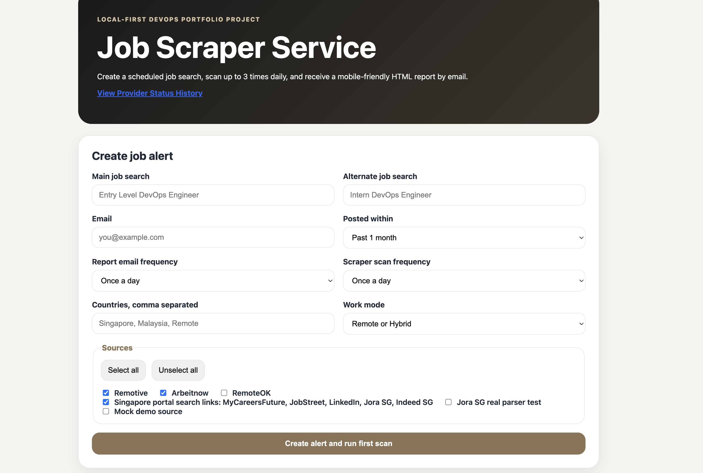
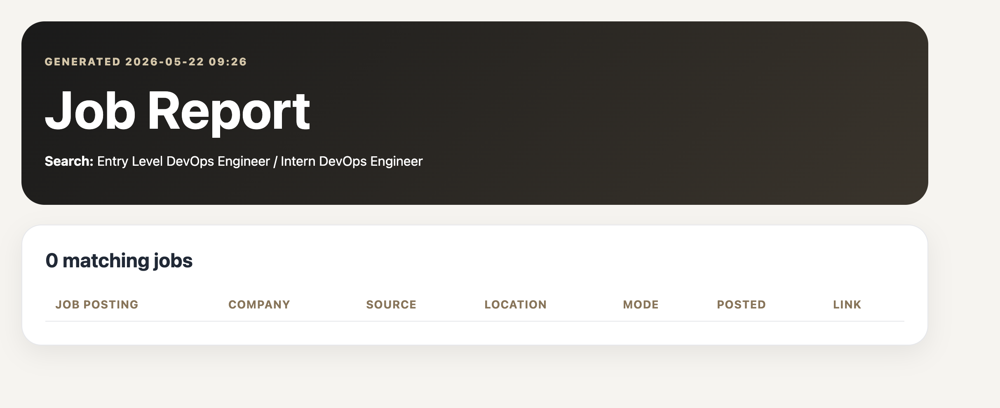
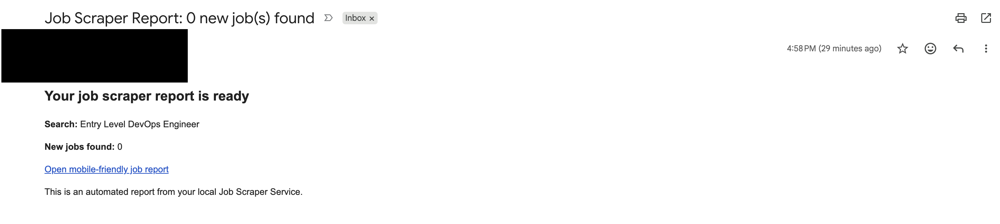
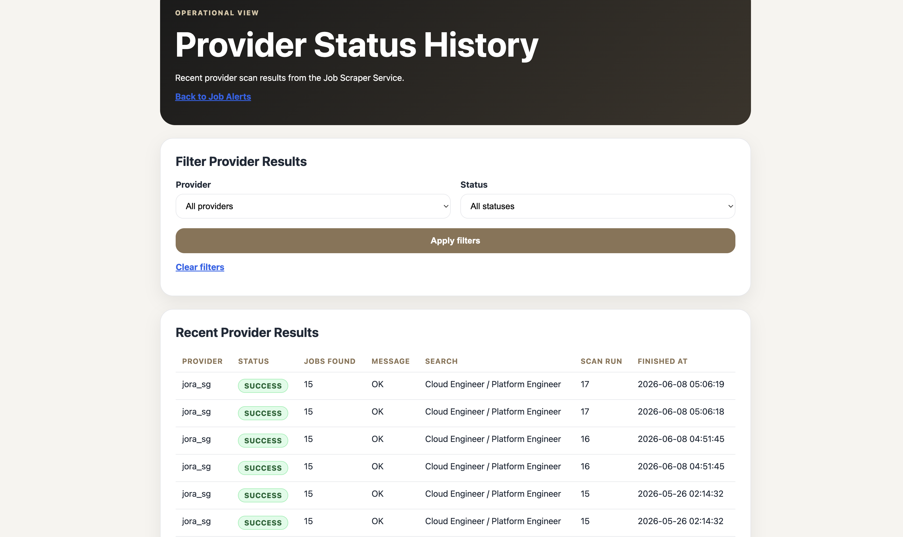
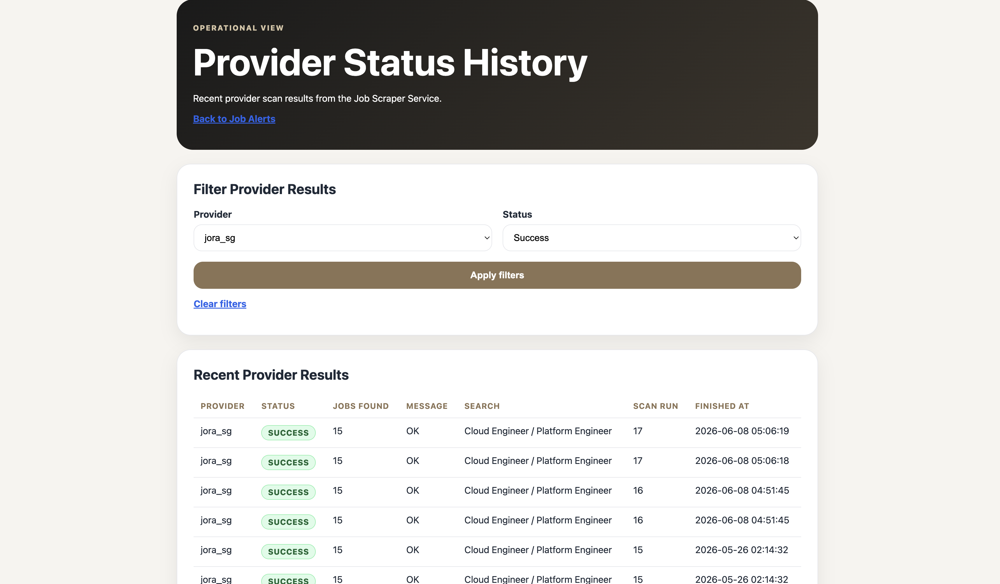
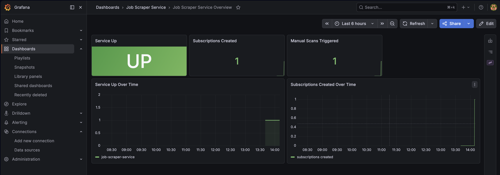
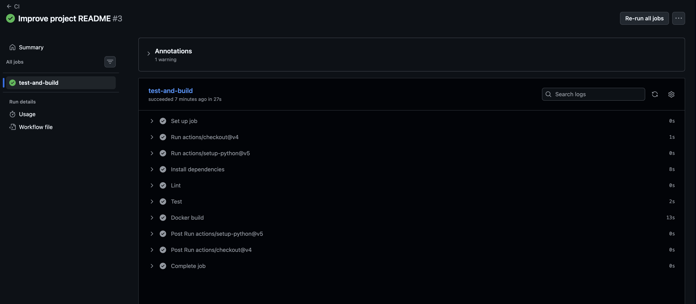
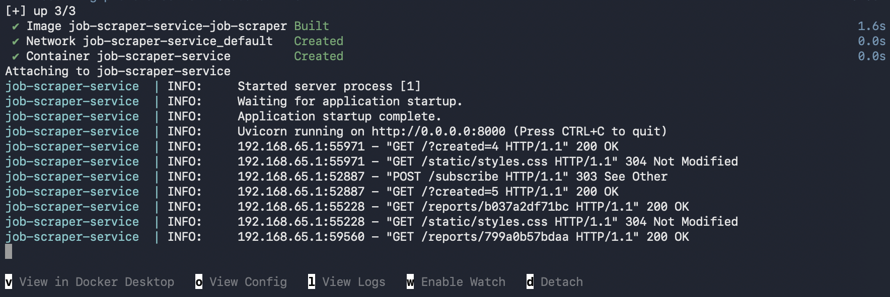
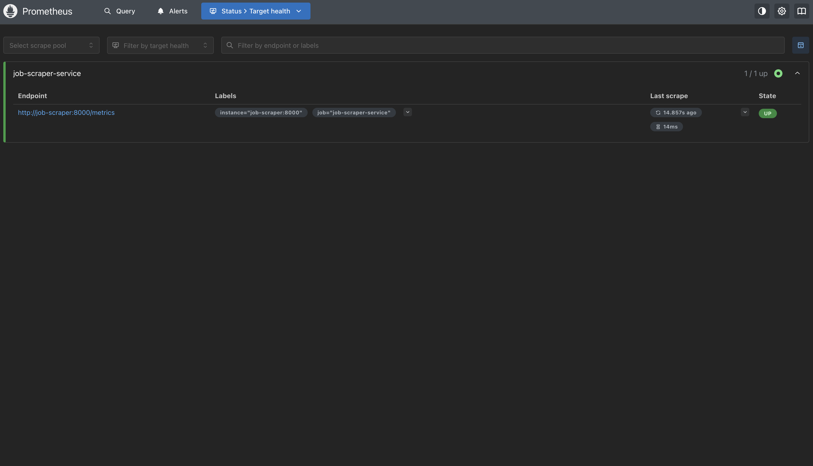
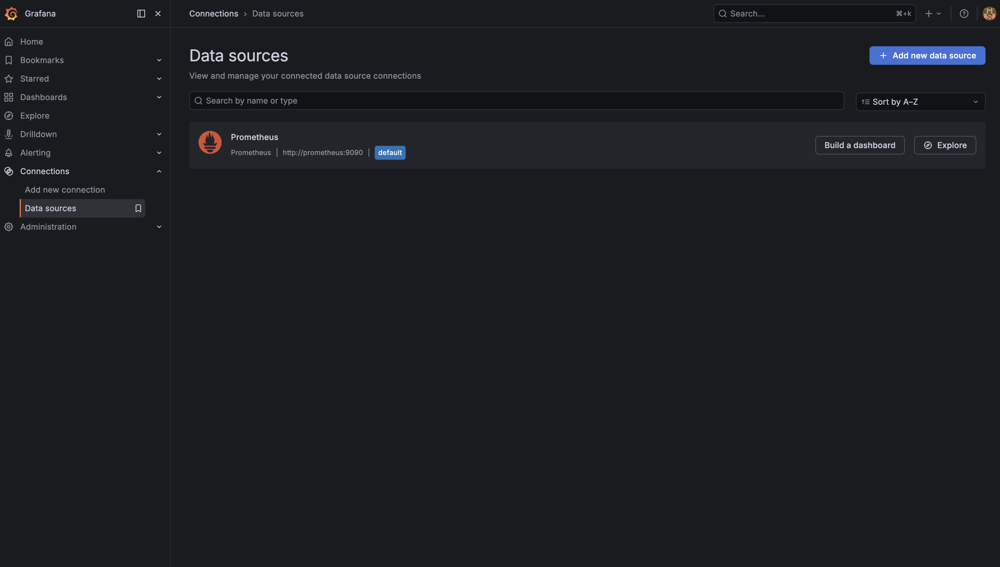
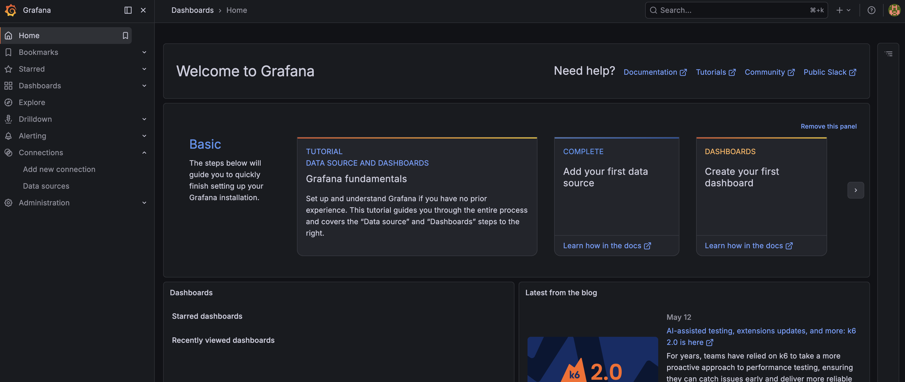
```

---

## Local Setup

### 1. Clone the Repository

```bash
git clone https://github.com/anarkeyv/job-scraper-service.git
cd job-scraper-service
```

### 2. Create a Virtual Environment

```bash
python3 -m venv .venv
source .venv/bin/activate
```

### 3. Install Dependencies

```bash
pip install --upgrade pip
pip install -r requirements.txt
```

### 4. Create the Environment File

```bash
cp .env.example .env
```

Open `.env` and update the required values.

Example:

```env
APP_BASE_URL=http://127.0.0.1:8000

SMTP_HOST=smtp.gmail.com
SMTP_PORT=587
SMTP_USERNAME=your_email@gmail.com
SMTP_PASSWORD=your_gmail_app_password
SMTP_FROM=your_email@gmail.com
```

Important: do not use your normal Gmail password. Use a Gmail App Password.

### 5. Run the Application Locally

```bash
uvicorn app.main:app
```

Open:

```text
http://127.0.0.1:8000
```

---

## Running with Docker Compose

```bash
docker compose up --build
```

Open:

```text
http://127.0.0.1:8000
```

Stop the containers:

```bash
docker compose down
```

---

## Running with Docker Compose and Monitoring

To start the application together with Prometheus and Grafana:

```bash
docker compose --profile monitoring up -d --build
```

This starts:

```text
FastAPI app    http://127.0.0.1:8000
Prometheus     http://127.0.0.1:9090
Grafana        http://127.0.0.1:3000
```

Check the app health endpoint:

```text
http://127.0.0.1:8000/health
```

Check the app metrics endpoint:

```text
http://127.0.0.1:8000/metrics
```

Check Prometheus targets:

```text
http://127.0.0.1:9090/targets
```

The `job-scraper-service` target should show as:

```text
UP
```

Grafana default login:

```text
Username: admin
Password: admin
```

Grafana is provisioned to connect to Prometheus as a data source.

The Grafana dashboard is provisioned automatically and can be found under:

```text
Dashboards → Job Scraper Service → Job Scraper Service Overview
```

Dashboard panels include:

```text
Service Up
Subscriptions Created
Manual Scans Triggered
Service Up Over Time
Subscriptions Created Over Time
```

Stop the full monitoring stack:

```bash
docker compose --profile monitoring down
```

If Docker Compose shows a stale network error, clean unused networks and restart:

```bash
docker compose --profile monitoring down --remove-orphans
docker network prune
docker compose --profile monitoring up -d --build
```

---

## Running from GitHub Container Registry

This project can also be run directly from the published GitHub Container Registry image.

Pull the image:

```bash
docker pull ghcr.io/anarkeyv/job-scraper-service:latest
```

Run the container using your local `.env` file:

```bash
docker run --rm   --env-file .env   -p 8000:8000   ghcr.io/anarkeyv/job-scraper-service:latest
```

Open the application:

```text
http://127.0.0.1:8000
```

This confirms that the application can run from a published container image without rebuilding from source.

---

## Running Tests

```bash
pytest
```

Expected result:

```text
1 passed
```

Or:

```bash
python -m pytest
```

---

## Email Setup Notes

This project uses SMTP for sending job reports by email.

For Gmail:

1. Enable 2-Step Verification on your Google Account.
2. Create a Gmail App Password.
3. Use the generated app password in `.env`.
4. Do not commit `.env` to GitHub.

The `.gitignore` file should exclude:

```gitignore
.env
.venv/
data/
reports/
__pycache__/
.pytest_cache/
```

---

## GitHub Actions

This repository includes a GitHub Actions workflow to run basic CI checks.

The workflow is intended to:

- Install Python dependencies
- Run automated tests
- Confirm the application can be imported successfully

This helps ensure the application remains stable when changes are pushed to GitHub.

---

## GitHub Container Registry

This repository includes a Docker publishing workflow.

The workflow is triggered when a GitHub Release is published.

Workflow summary:

```text
Create GitHub Release
        ↓
GitHub Actions starts Docker publish workflow
        ↓
Login to GitHub Container Registry
        ↓
Build Docker image
        ↓
Push image to ghcr.io
        ↓
Image becomes available as a GitHub Package
```

Published image:

```text
ghcr.io/anarkeyv/job-scraper-service:latest
```

This allows the application to be pulled and run as a container image.

---

## Jenkins Pipeline

A `Jenkinsfile` is included in the repository.

The Jenkins pipeline is designed to:

- Check out the repository
- Build the Docker image
- Run `pytest` inside the Docker image
- Start a test application container
- Perform a `/health` smoke test
- Clean up the test container

Jenkins pipeline stages:

```text
Checkout
Build Docker Image
Run Tests
Smoke Test Container
```

The local Jenkins demo was tested using a separate Jenkins container on port `8081`.

Tested Jenkins flow:

```text
Jenkins cloned the GitHub repository
Jenkins built the Docker image
Jenkins ran pytest inside the Docker image
Jenkins started the app container on port 8001
Jenkins checked http://host.docker.internal:8001/health
Jenkins received {"status":"ok"}
Jenkins finished successfully
```

Important note:

```text
The repository includes the Jenkinsfile version of the pipeline.
The local Jenkins demo may use the same pipeline logic as an inline Jenkins script if the local Jenkins SCM configuration has issues reading the Jenkinsfile directly from GitHub.
```

This still demonstrates the main Jenkins CI process clearly.

---

## Monitoring with Prometheus and Grafana

The project includes a monitoring setup using Prometheus and Grafana.

Prometheus configuration:

```text
monitoring/prometheus/prometheus.yml
```

Grafana data source provisioning configuration:

```text
monitoring/grafana/provisioning/datasources/prometheus.yml
```

Grafana dashboard provisioning configuration:

```text
monitoring/grafana/provisioning/dashboards/dashboard.yml
```

Grafana dashboard JSON:

```text
monitoring/grafana/dashboards/job-scraper-dashboard.json
```

Prometheus is configured to scrape the app through Docker Compose networking:

```text
job-scraper:8000
```

Monitoring has been tested successfully:

```text
Prometheus opened successfully
Grafana opened successfully
Grafana connected to Prometheus
job-scraper-service target showed UP
/metrics endpoint worked
Grafana dashboard loaded automatically
Subscription counter updated in Grafana
```

Current Grafana dashboard panels:

```text
Service Up
Subscriptions Created
Manual Scans Triggered
Service Up Over Time
Subscriptions Created Over Time
```

Future monitoring improvements:

- Add custom application metrics for scan runs
- Track number of generated reports
- Track email send success/failure counts
- Track provider failures
- Track provider success rates
- Track scrape duration
- Add alert rules for provider failures
- Add alert rules for application downtime

---

## Ansible Local Deployment

The project includes an Ansible playbook for local deployment automation:

```text
ansible/deploy-local.yml
```

The playbook is designed to automate the local Docker Compose deployment process.

It performs the following tasks:

- Checks that Docker is installed
- Shows the Docker version
- Checks that Docker Compose is available
- Shows the Docker Compose version
- Confirms the project directory exists
- Confirms the `.env` file exists
- Stops the existing Docker Compose stack
- Builds and starts the Docker Compose stack
- Shows running containers
- Waits for the `/health` endpoint to return HTTP 200
- Displays a deployment success message

Run the playbook:

```bash
ansible-playbook ansible/deploy-local.yml
```

Expected final result:

```text
Job Scraper Service deployed successfully and health check passed.
```

This demonstrates basic deployment automation and fits a local homelab workflow.

---

## Docker

Docker is included so that the project can run consistently across different machines.

This is useful for:

- Local development
- Homelab deployment
- Cloud VM deployment
- CI/CD pipelines
- Future Kubernetes deployment

The application has been tested in the following ways:

```text
Local Python virtual environment
Docker Compose
Docker Compose with monitoring profile
Published GHCR Docker image
Jenkins-built Docker image
Ansible-managed Docker Compose deployment
```

---

## Kubernetes

The `k8s/` folder is included as a starter for container orchestration.

Possible future uses:

- Deploy the FastAPI app to a Kubernetes cluster
- Expose the app with a Service
- Add ConfigMaps and Secrets
- Add health checks
- Prepare for homelab Kubernetes or cloud Kubernetes deployment

---

## Terraform

The `terraform/` folder includes starter folders for AWS and GCP.

Possible future uses:

- Provision a small VM
- Set up networking
- Create firewall rules
- Prepare infrastructure for the app
- Demonstrate Infrastructure as Code

---

## Current Limitations

The current version is an MVP and may not include all production features.

Known limitations:

- SQLite is used for local storage.
- Email delivery depends on SMTP configuration.
- Some job sources may require provider-specific logic.
- Full user authentication is not included.
- Report hosting is local unless deployed to a public server.
- The app is not yet production-hardened.
- Kubernetes, Terraform, Ansible, Jenkins, and monitoring are included as starter DevOps components but can be expanded further.
- Provider status reporting currently groups results at provider/status level for the latest scan.
- Jora SG parsing is a best-effort parser and may need updates if the website markup changes.
- LinkedIn, Indeed, JobStreet, and MyCareersFuture are currently handled safely as search-link sources instead of direct scrapers.
- Prometheus counters reset when the application container restarts because they are in-memory metrics.

---

## Future Improvements

Planned improvements include:

- Add user authentication
- Add subscription management page
- Add unsubscribe link
- Add more job providers
- Add provider status history export
- Add provider failure metrics
- Add per-provider error reporting in the email body
- Add deduplication improvements
- Add PostgreSQL support
- Add proper background worker with Celery or RQ
- Add API documentation page
- Add richer Prometheus custom metrics
- Add more Grafana panels
- Add Prometheus alert rules
- Add Kubernetes secrets and config maps
- Add Terraform deployment for AWS or GCP
- Add Ansible playbook for remote homelab deployment
- Add CI/CD deployment workflow
- Add Jenkins SCM configuration fix so Jenkins can read the `Jenkinsfile` directly from GitHub without using an inline script workaround
- Add mobile UI improvements
- Add dark mode
- Add CSV export
- Add PDF report export

---

## Security Notes

Do not commit secrets to GitHub.

The following files and folders should not be committed:

```text
.env
.venv/
data/
reports/
```

Use `.env.example` to show required configuration values without exposing real credentials.

---

## Suggested Demo Script

A short demo flow:

```text
1. Open the website.
2. Explain the purpose of the job scraper.
3. Create a new job alert.
4. Show the source select all / unselect all controls.
5. Show the generated HTML report.
6. Show the Provider Status Summary in the report.
7. Show the email received.
8. Show the Provider Summary table in the email.
9. Open the report from the email.
10. Show safe Singapore portal search links.
11. Show Jora SG parser results for Cloud Engineer / Platform Engineer.
12. Show the Provider Status History page.
13. Show provider/status filters.
14. Show provider status badges.
15. Show the GitHub repository.
16. Show the passing GitHub Actions workflow.
17. Show the Docker publish workflow.
18. Show the published GitHub Container Registry package.
19. Run the app from the published GHCR image.
20. Show Docker Compose support.
21. Show the Jenkins pipeline success screen.
22. Explain the Jenkins stages: clone, build, test, smoke test, cleanup.
23. Show Prometheus target status as UP.
24. Show Grafana connected to Prometheus.
25. Show the provisioned Grafana dashboard.
26. Run the Ansible local deployment playbook.
27. Explain the Ansible deployment checks and health validation.
28. Explain future DevOps expansion with Kubernetes, Terraform, dashboards, alerting, and homelab deployment.
```

---

## Skills Demonstrated

This project demonstrates:

- Python web development
- FastAPI routing
- HTML template rendering
- SQLite database usage
- Provider-based application design
- Lightweight web parsing with BeautifulSoup
- Responsible scraping design
- Provider status and reliability reporting
- Provider status filtering
- Email report enhancement
- Background job execution
- SMTP email configuration
- Docker containerization
- Docker Compose orchestration
- Docker Compose profiles
- Git and GitHub workflow
- GitHub Actions CI
- GitHub Container Registry publishing
- Docker image pull and run testing
- Jenkins local CI pipeline setup
- Jenkins Docker build and smoke testing
- Prometheus monitoring setup
- Grafana data source provisioning
- Grafana dashboard provisioning
- Ansible local deployment automation
- Basic automated testing
- DevOps project structuring
- Infrastructure as Code planning
- Monitoring and observability planning
- Homelab deployment planning

---

## License

This project is intended for learning, portfolio demonstration, and local personal use.

Before deploying publicly or scraping third-party sites, review the terms of service of each data source.

---

## Author

Created as a Cloud Support and DevOps portfolio project.
